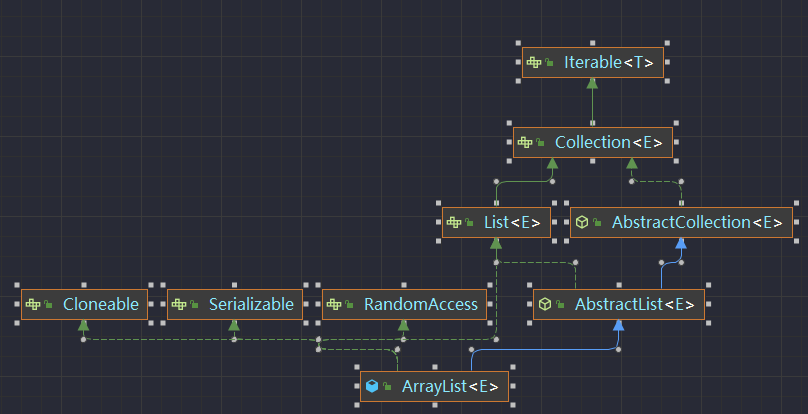

# ArrayList源码分析


```java
数组可能是我们最早接触到的数据结构之一，它是在内存中划分出一块连续的地址空间用来进行元素的存储，由于它直接操作内存，所以数组的性能要比集合类更好一些，这是使用数组的一大优势
```
致命缺陷：
1. 初始化时必须指定数组大小，并且在后续操作中不能再更改数组的大小

ArrayList  是基于数组实现.
````
//默认初始化容量
private static final int DEFAULT_CAPACITY = 10;

//空对象数组
private static final Object[] EMPTY_ELEMENTDATA = {};
 
//对象数组
private transient Object[] elementData;
````

个数
```java
//集合元素个数
private int size;
```

```java
//传入初始容量的构造方法
public ArrayList(int initialCapacity) {
    super();
    if (initialCapacity < 0) {
        throw new IllegalArgumentException("Illegal Capacity: "+ initialCapacity);
    }
    //新建指定容量的Object类型数组
    this.elementData = new Object[initialCapacity];
}
 
//不带参数的构造方法
public ArrayList() {
    super();
    //将空的数组实例传给elementData
    this.elementData = EMPTY_ELEMENTDATA;
}
 
//传入外部集合的构造方法
public ArrayList(Collection<? extends E> c) {
    //持有传入集合的内部数组的引用
    elementData = c.toArray();
    //更新集合元素个数大小
    size = elementData.length;
    //判断引用的数组类型, 并将引用转换成Object数组引用
    if (elementData.getClass() != Object[].class) {
        elementData = Arrays.copyOf(elementData, size, Object[].class);
    }
}
```

#### 增删改查
```java
//增(添加)
public boolean add(E e) {
    //添加前先检查是否需要拓展数组, 此时数组长度最小为size+1
    ensureCapacityInternal(size + 1);
    //将元素添加到数组末尾
    elementData[size++] = e;
    return true;
}
 
 
//增(插入)
public void add(int index, E element) {
    //插入位置范围检查
    rangeCheckForAdd(index);
    //检查是否需要扩容
    ensureCapacityInternal(size + 1);
    //挪动插入位置后面的元素
    System.arraycopy(elementData, index, elementData, index + 1, size - index);
    //在要插入的位置赋上新值
    elementData[index] = element;
    size++;
}
 
//删
public E remove(int index) {
    //index不能大于size
    rangeCheck(index);
    modCount++;
    E oldValue = elementData(index);
    int numMoved = size - index - 1;
    if (numMoved > 0) {
        //将index后面的元素向前挪动一位
        System.arraycopy(elementData, index+1, elementData, index, numMoved);
    }
    //置空引用
    elementData[--size] = null;
    return oldValue;
}
 
//改
public E set(int index, E element) {
    //index不能大于size
    rangeCheck(index);
    E oldValue = elementData(index);
    //替换成新元素
    elementData[index] = element;
    return oldValue;
}
 
//查
public E get(int index) {
    //index不能大于size
    rangeCheck(index);
    //返回指定位置元素
    return elementData(index);
}
```
