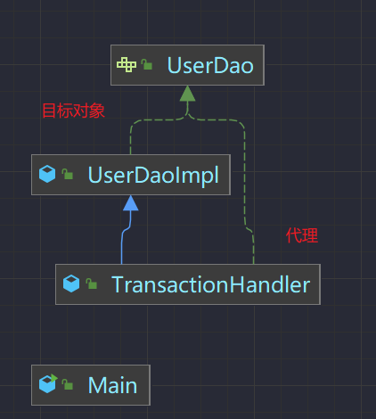

# JDK动态代理（1）代理模式实现方式的概要介绍📃

##### 什么是代理模式,为什么使用代理，代理模式实现方式有哪些,底层机制是怎样的

----

1. 代理是中间人
2. 代理能让我们专注别的事情,其余事情交给中介去做
3. 静态代理 和 动态代理

### 静态实现📃📃



```java
/**
 * @version 1.0.1
 * @program: nirvana
 * @description: 接口
 * @author: Mr.wang.sutton
 * @create: 2022-10-20 15:54
 **/
public interface UserDao {

    /**
     * 保存接口
     */
    void save();
}

```

此接口是为了 **中介对象** 和  **代理** 都可以有相应的方法，意思是我小小中介既然要为你
做事说明我要知道这件事情是什么事情,其余是我自己的事情.

```java
/**
 * @version 1.0.1
 * @program: nirvana
 * @description: 目标对象
 * @author: Mr.wang.sutton
 * @create: 2022-10-20 15:54
 **/
public class UserDaoImpl implements UserDao {

    /**
     * 保存接口
     */
    @Override
    public void save() {
        System.out.println("正在保存用户.....");
    }
}
```

目前我有一个保存人的事情，但是我觉得我做的不够好,我需要中间商去帮我处理这件事情.

```java
public class TransactionHandler extends UserDaoImpl implements UserDao {


    /**
     * 传入需要被代理的类型
     */
    private UserDaoImpl userDao;


    /**
     * 传入需要被代理的对象
     * @param userDao
     */
    public TransactionHandler(UserDaoImpl userDao) {
        this.userDao = userDao;
    }


    /**
     * 保存接口
     */
    @Override
    public void save() {
        System.out.println("开启事务");
        userDao.save();
        System.out.println("结束事务");
    }
}

```

要我帮你做事可以啊，但是前提是我需要知道你要给我什么功能，所以这里是需要目标对象的一个引用.

缺点:

~~~
但是静态代理不能使一个代理类反复作用于多个目标对象，代理对象直接持有目标对象的引用，这导致代理对象和目标对象类型紧密耦合了在一起。如果UserDao接口下还有另一个实现类也需要进行事务控制，
那么就要重新写一个代理类，这样就会产生许多重复的模版代码，
不能达到代码复用的目的。而动态代理就可以很好的解决这样的问题
~~~

### 动态代理🤑

动态代码如何解决持有目标对象的引用.通过 **Object**.那么在动态代理也更换了调用方法的方式


